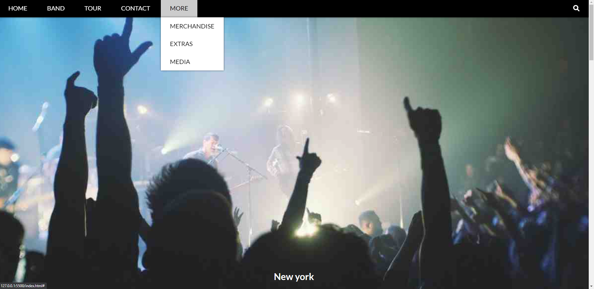
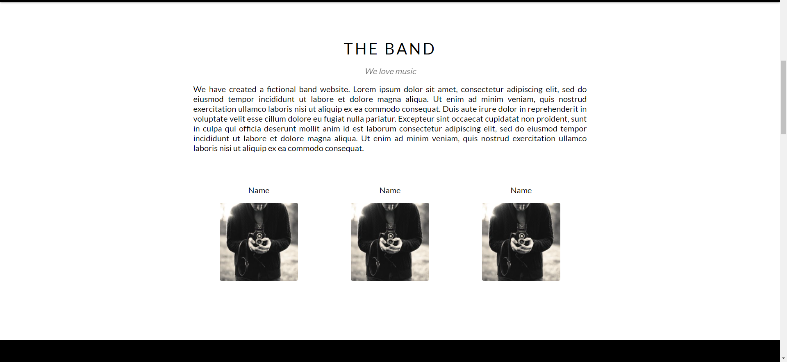
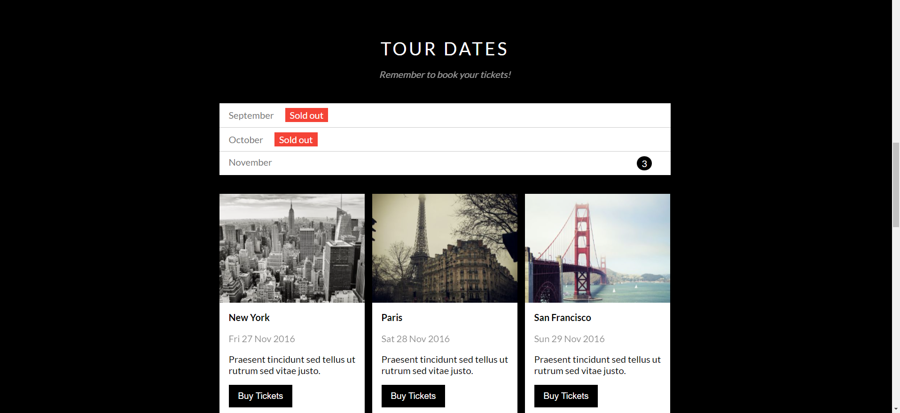
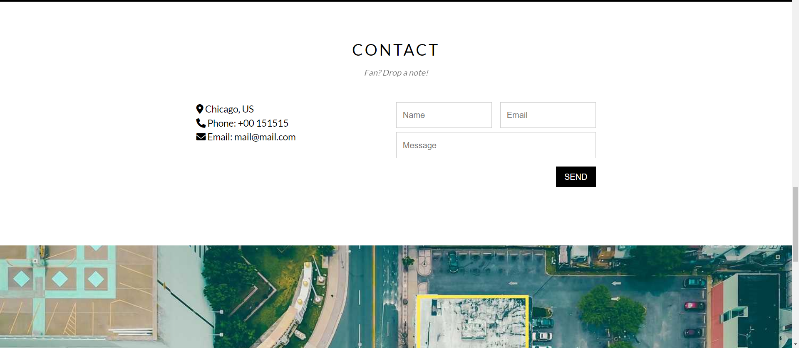
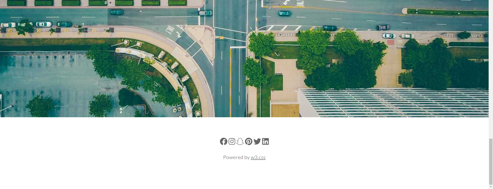
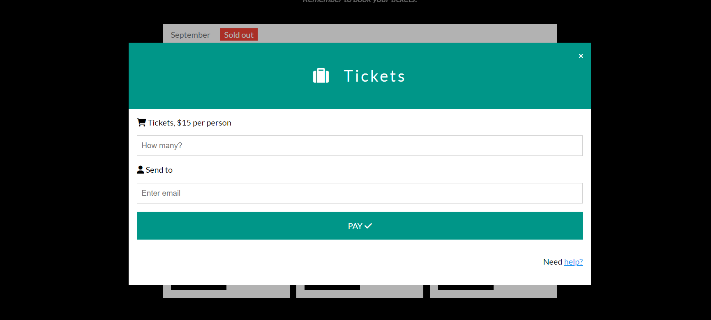
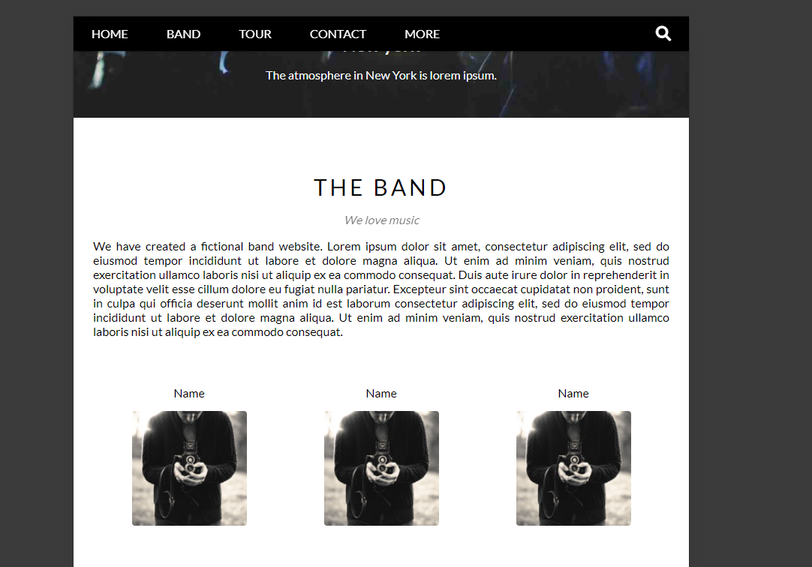
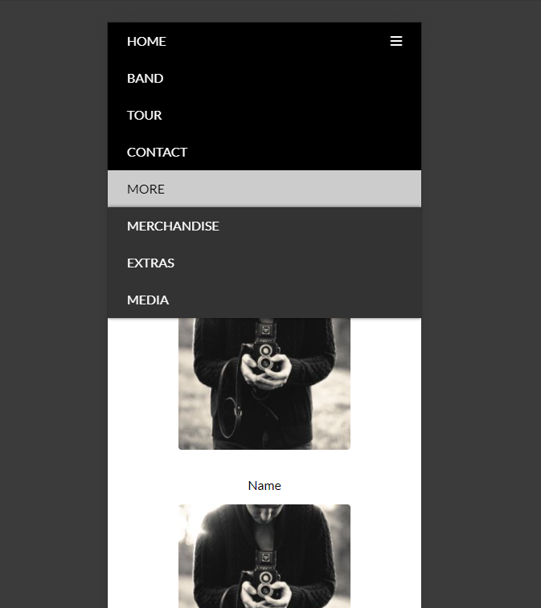

# ✨Trang web Shopee Clone

Đây là trang web **The Band Clone** 🛒, lấy từ [template mẫu của W3School](https://www.w3schools.com/w3css/tryw3css_templates_band.htm).

Code được thực hiện theo các bài giảng của anh Sơn ở trang web [F8](https://fullstack.edu.vn/).

**Thời gian thực hiện:** 6/2/2022 - 15/2/2022.

**Kiến thức sử dụng:**

1. HTML&CSS bao gồm Flexbox, BEM, Media Queries.
2. Javascript chỉ sử dụng DOM cơ bản để xử lý sự kiện và thay đổi nội dung/giao diện.

**Demo sản phẩm:**

> Header và slider

> Thông tin ban nhạc

> Thông tin tour diễn

> Contact và một phần của map

> Phần còn lại của map và footer

> Modal mua vé

> Repsonsive Tablet

> Responsive Mobile

**Về tác giả:**

[Github](https://github.com/marucube35)\
[Facebook](https://www.facebook.com/profile.php?id=100009916021095)
